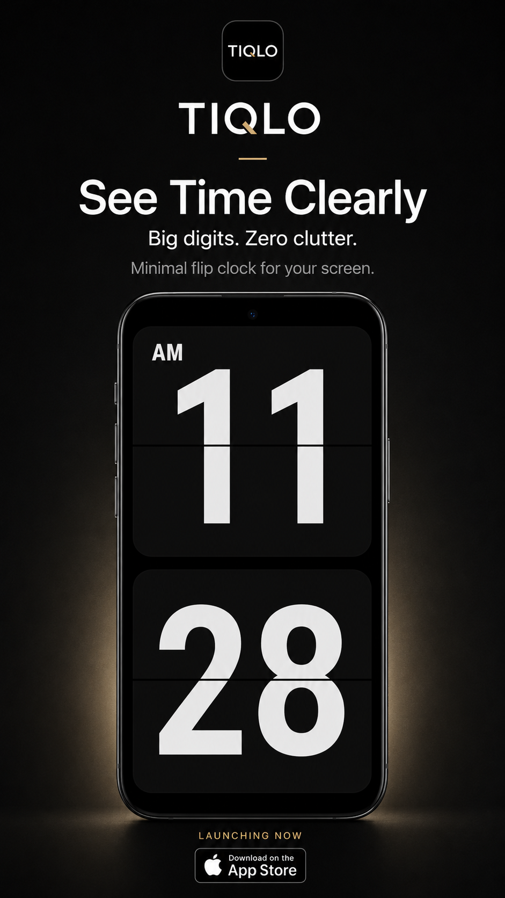
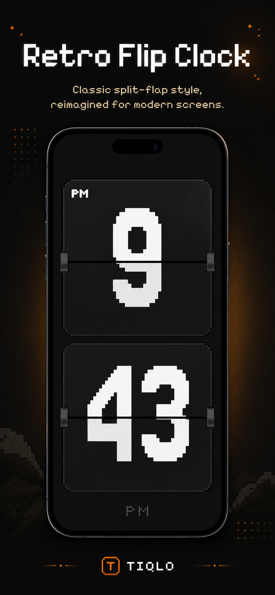
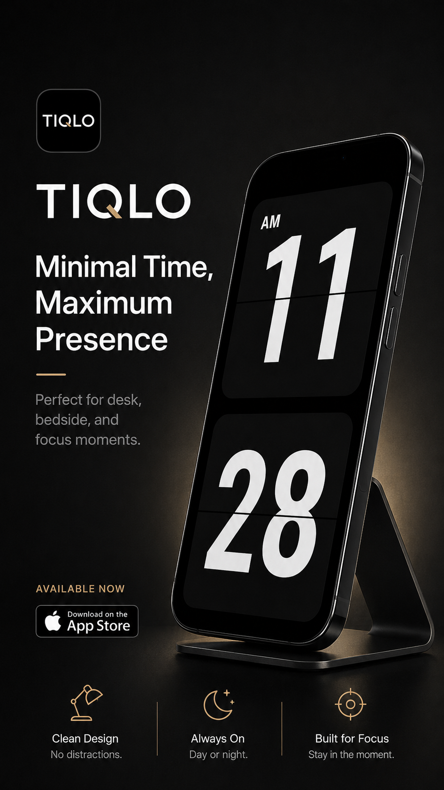

<p align="center">
  
</p>

<h1 align="center">Tiqlo</h1>

<p align="center">
  A full-screen clock for seeing time clearly.
</p>

<p align="center">
  <a href="https://tiqlo.link/">Website</a> ·
  <a href="README.md">English</a> ·
  <a href="README.zh-CN.md">简体中文</a> ·
  <a href="README.zh-TW.md">繁體中文</a>
</p>

---

Tiqlo offers Digital and Flip faces, plus built-in Focus and Timer countdowns.

<p align="center">
  
  
  
</p>

---

## Features

- Digital and Flip clock faces, each with its own colour palettes.
- Responsive portrait and landscape layouts; full-screen support on Web and desktop.
- 12/24-hour time, leading zero, seconds, date, and weekday options.
- Night Mode dims the display and temporarily hides the date and seconds.
- Focus and Timer sessions with pause, resume, stop, and completion alerts.
- Completed Focus sessions contribute to today's count and minutes.
- Configurable keep-awake, sound, and vibration preferences.
- Settings persist locally across launches.

## Development

Flutter SDK is required. The project's Dart SDK constraint is `^3.12.2`.

```bash
flutter pub get
flutter run -d chrome
```

Run tests:

```bash
flutter test
```

Build a production Web bundle:

```bash
flutter build web --release
```

Deploy the entire generated `build/web/` directory to a static server. When serving the app from a subpath, provide the matching `--base-href` while building.

---

## Stack

- Flutter / Dart
- Riverpod
- go_router
- shared_preferences
- intl

## Principles

- Clock always represents wall-clock time; Focus and Timer temporarily replace the display only while active.
- Sessions use monotonic time, so device clock changes do not affect countdowns.
- Portrait and landscape are layouts of one Clock, not separate pages.

See [docs/adr](docs/adr) for design decisions.

---

## License

Licensed under the [MIT License](LICENSE).
