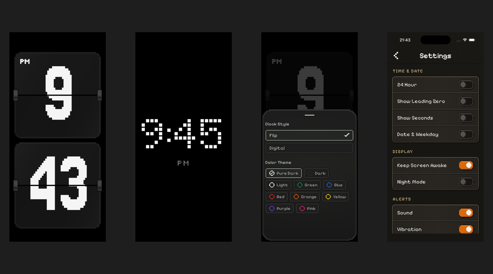
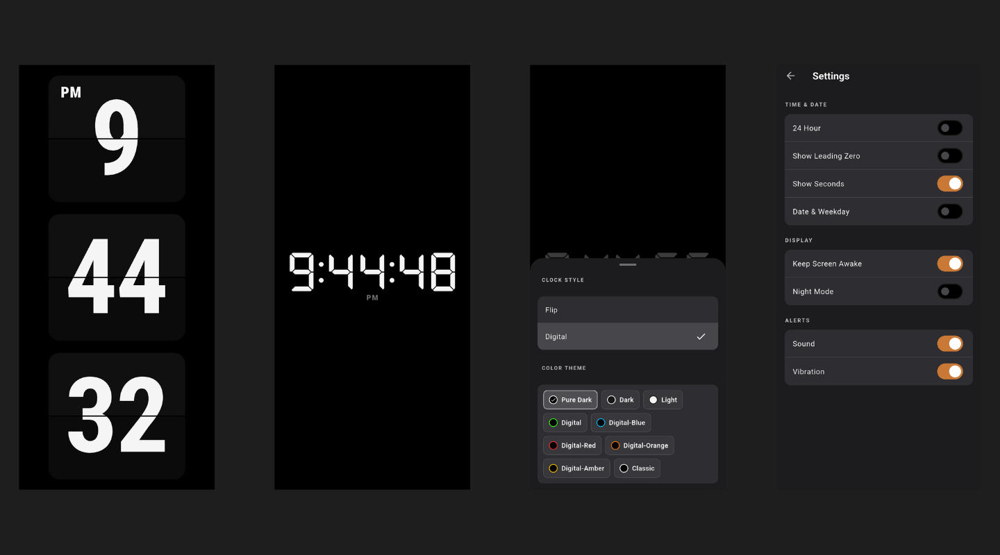
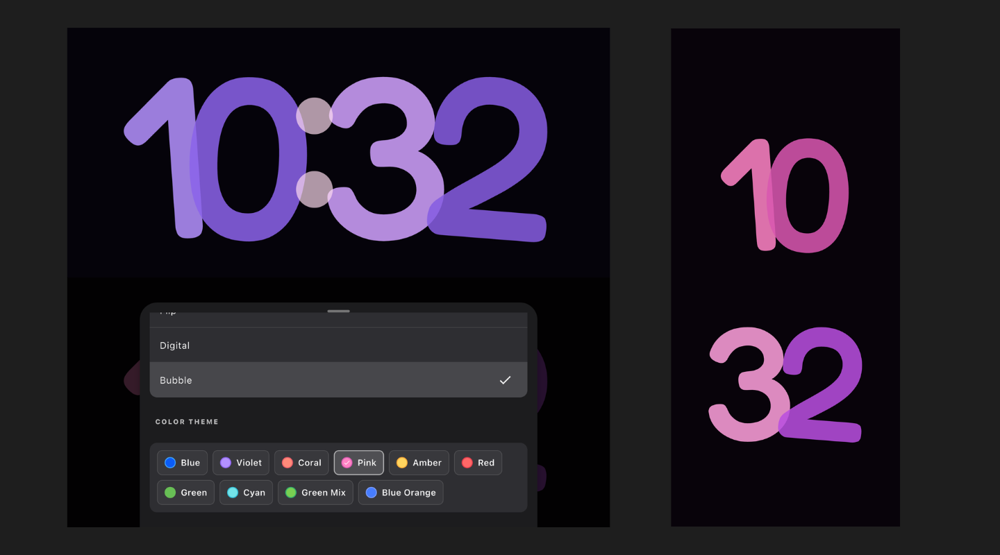

<h1 align="center">Tiqlo — Flutter 翻页、数字与 Bubble 时钟</h1>

<p align="center">
  一款开源跨平台时钟应用，提供 Flip、Digital、Bubble 三种表盘、像素与标准两种界面风格，以及 Focus 和 Timer 模式。
</p>

<p align="center">
  <a href="https://flutter.dev/"></a>
  <a href="LICENSE"></a>
  <a href="https://github.com/ducafecat/flutter_tiqlo_clock/stargazers"></a>
  <a href="https://apps.apple.com/us/app/tiqlo-pixel-flip-clock/id6804964763"></a>
  
</p>

<p align="center">
  <a href="https://apps.apple.com/us/app/tiqlo-pixel-flip-clock/id6804964763">App Store</a> ·
  <a href="https://tiqlo.link/#demo">在线体验</a> ·
  <a href="https://tiqlo.link/">产品网站</a> ·
  <a href="README.md">English</a> ·
  <a href="README.zh-CN.md">简体中文</a> ·
  <a href="README.zh-TW.md">繁體中文</a>
</p>

<p align="center">
  
  <br />
  像素风格（默认）
</p>

<p align="center">
  
  <br />
  标准风格
</p>

<p align="center">
  
  <br />
  Bubble 时钟主题
</p>

---

Tiqlo 是一款面向手机、桌面和 Web 的开源跨平台 Flutter 时钟应用。你可以选择像素或标准界面，再切换 Flip、Digital 与 Bubble 时钟表盘。像素风格将清晰的像素几何延伸到时钟、控件和面板；Bubble 主题以超大圆润数字显示时间，并为数字分别配色，提供十套调色板。你可以将它用作全屏桌面时钟，也可以在需要集中注意力时启动内置 Focus 或 Timer 计时。响应式布局让时间在横屏和竖屏中都清晰易读。

## 体验 Tiqlo

Tiqlo 已上架 [App Store](https://apps.apple.com/us/app/tiqlo-pixel-flip-clock/id6804964763)。也可以在浏览器中打开 [Tiqlo 在线 Web 应用](https://tiqlo.link/#demo)，无需克隆代码、注册账号或安装软件。点击时钟即可显示控制项。

## 时钟功能

- 三种时钟表盘：Flip、Digital 和 Bubble；在任一界面风格下都可从 Clock Style 面板切换。
- 两种界面风格：像素风（默认）和标准风格。
- Bubble 圆润数字表盘支持分别为数字配色，并提供十套调色板。
- 像素风格将像素美学贯穿时钟表盘、字体、控件、面板与翻页过渡。
- 免费、无广告，并基于 MIT License 开源；无需账号。
- Flip 与 Digital 表盘均可分别选择配色。
- 自适应横竖屏布局；Web 与桌面端支持全屏显示。
- 12 / 24 小时制、前导零、秒数、日期和星期显示开关。
- Night Mode：降低显示亮度、暂时隐藏日期和秒数，并将 Bubble 切换为深红配色。
- Focus 与 Timer Session：暂停、继续、停止和完成提醒。
- Focus 完成后记录当日次数和分钟数。
- 可配置屏幕常亮、提示音与震动。
- 设置会保存在本地，下次启动自动恢复。

## 像素风不只是一套字体

- 四套专用像素字体分别塑造翻页数字、数码数字、界面文字和紧凑 HUD 标签的视觉个性。
- 网格对齐间距、阶梯切角、清晰描边和零模糊硬阴影，将像素语言延伸到每一个组件，而不只停留在时钟表面。
- 克制的深色配色与高对比时钟界面，兼顾复古感与远距离可读性。
- 使用动态 Flutter Widget，在不栅格化界面的前提下，保留响应式布局、无障碍点击区、键盘焦点状态和流畅的翻页过渡。

## Bubble 时钟主题

- Fredoka 圆润数字与圆点冒号，组成醒目的大尺寸时钟表盘。
- 十套调色板可分别为小时和分钟数字配色，所选配色会保存在本地。
- 横屏采用单行布局，竖屏会自动调整表盘排布；数字变化时带有平滑动画。

## 运行 Flutter 时钟应用

需要 Flutter SDK（项目 Dart SDK 约束为 `^3.12.2`）。

```bash
flutter pub get
flutter run -d chrome
```

运行测试：

```bash
flutter test
```

构建 Web 发布产物：

```bash
flutter build web --release
```

将生成的整个 `build/web/` 目录部署到静态服务器。若部署在子路径，构建时需传入相应的 `--base-href`。

---

## Flutter 包列表

- 状态与路由：`flutter_riverpod`、`riverpod_annotation`、`go_router`
- 模型与本地数据：`freezed_annotation`、`json_annotation`、`shared_preferences`、`intl`、`logger`
- 提醒与设备能力：`flutter_local_notifications`、`timezone`、`wakelock_plus`、`screen_brightness`、`flutter_fullscreen`
- UI、资源与链接：`cupertino_icons`、`image`、`path`、`url_launcher`、`flutter_native_splash`
- 开发与测试：`flutter_test`、`build_runner`、`riverpod_generator`、`freezed`、`json_serializable`、`flutter_lints`、`riverpod_lint`、`icons_launcher`、`shared_preferences_platform_interface`

当前版本与完整配置请查看 [`pubspec.yaml`](pubspec.yaml)。

## Tiqlo 使用的像素与 Bubble 字体

| 字体 | Flutter family | 字重 / 文件 | 用途 |
| --- | --- | --- | --- |
| Pixelify Sans | `PixelifySans` | 400 `PixelifySans-Regular.ttf`<br>600 `PixelifySans-SemiBold.ttf` | 界面标题、按钮、设置项与短文案 |
| Tiny5 | `Tiny5` | 400 `Tiny5-Regular.ttf` | AM/PM、FOCUS、TIMER、PAUSED 等紧凑 HUD 标签 |
| Jersey 25 | `Jersey25` | 400 `Jersey25-Regular.ttf` | 翻页时钟数字 |
| DotGothic16 | `DotGothic16` | 400 `DotGothic16-Regular.ttf` | 数字时钟数字 |
| Fredoka | `BubbleClock` | 500 `Fredoka-Medium.ttf` | Bubble 时钟数字 |

表中字体采用 SIL Open Font License 1.1。像素字体的上游来源、固定校验值与许可文件记录在 [`fonts/licenses`](fonts/licenses/SOURCES.md)；Fredoka 的许可文件随字体附于 [`assets/fonts/bubble/OFL.txt`](assets/fonts/bubble/OFL.txt)。

## 开发 Skills

项目开发中使用了以下 skills：

- [mattpocock/skills](https://github.com/mattpocock/skills)
- [ducafecat/skills](https://github.com/ducafecat/skills)

## 设计原则

- Clock 始终显示墙上时间；Focus 和 Timer 仅在运行期间临时替换显示。
- Session 使用单调时间计算，避免设备时间变化影响倒计时。
- 横竖屏只是同一 Clock 的布局变化，不是两套页面。

更多设计决策见 [docs/adr](docs/adr)。

---

## 许可证

本项目采用 [MIT License](LICENSE)。
