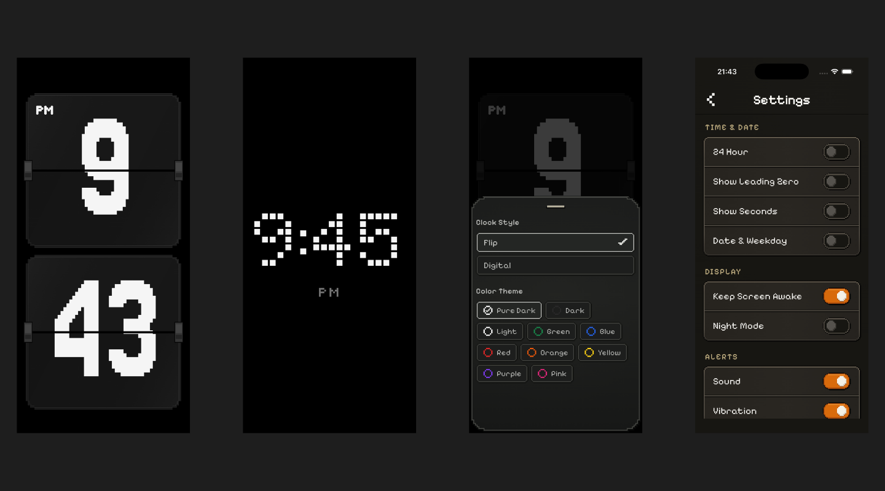
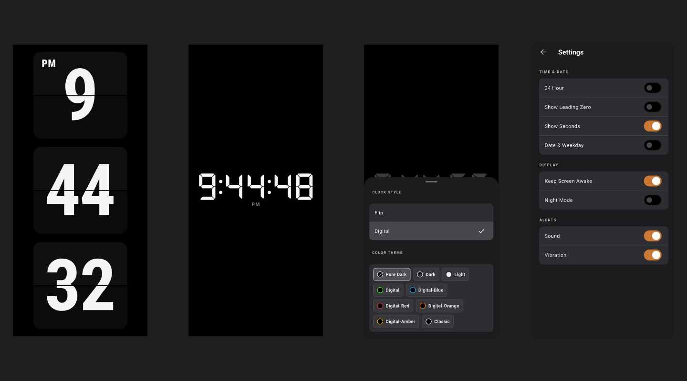

<h1 align="center">Tiqlo — Flutter 像素風翻頁時鐘與專注計時器</h1>

<p align="center">
  一款以完整像素風視覺系統為特色，支援 Flip、Digital、Focus 與 Timer 模式的開源跨平台時鐘。
</p>

<p align="center">
  <a href="https://flutter.dev/"></a>
  <a href="LICENSE"></a>
  <a href="https://github.com/ducafecat/flutter_tiqlo_clock/stargazers"></a>
  
</p>

<p align="center">
  <a href="https://tiqlo.link/#demo">線上體驗</a> ·
  <a href="https://tiqlo.link/">產品網站</a> ·
  <a href="README.md">English</a> ·
  <a href="README.zh-CN.md">簡體中文</a> ·
  <a href="README.zh-TW.md">繁體中文</a>
</p>

<p align="center">
  
  <br />
  像素風格（預設）
</p>

<p align="center">
  
  <br />
  標準風格
</p>

---

Tiqlo 是一款面向手機、桌面和 Web 的開源跨平台 Flutter 時鐘應用程式。它與一般時鐘應用程式最不同的地方，是從 Flip 與 Digital 時鐘介面，到面板、按鈕、描邊和陰影，都採用一致的像素風視覺系統，而不只是換上一套像素字體。
你可以將它用作全螢幕桌面時鐘，也可以在需要集中注意力時啟動內建 Focus 專注計時或 Timer 倒數計時。響應式設計讓時間在橫向和直向畫面中都能保持遠距離可讀性。

## 線上體驗 Tiqlo

在瀏覽器中開啟 [Tiqlo 線上 Web 應用程式](https://tiqlo.link/#demo)，無需複製程式碼、註冊帳號或安裝軟體。點擊時鐘即可顯示控制項。

## 像素風時鐘功能

- 兩種介面主題：預設像素風，以及標準風格。可在彈出選單 More 中切換。
- 獨特且完整的像素風體驗，貫穿時鐘介面、字體、控制項、面板與翻頁過渡。
- 免費、無廣告，並基於 MIT License 開源；無需帳號。
- 兩種 Clock 外觀：Digital 與 Flip，可分別選擇配色。
- 自適應橫豎螢幕版面；Web 與桌面端支援全螢幕顯示。
- 12 / 24 小時制、前導零、秒數、日期和星期顯示開關。
- Night Mode：降低顯示亮度，並暫時隱藏日期和秒數。
- Focus 與 Timer Session：暫停、繼續、停止和完成提醒。
- Focus 完成後記錄當日次數和分鐘數。
- 可設定螢幕常亮、提示音與震動。
- 設定會儲存在本機，下次啟動時自動恢復。

## 像素風不只是一套字體

- 四套專用像素字體分別塑造翻頁數字、數位數字、介面文字和緊湊 HUD 標籤的視覺個性。
- 網格對齊間距、階梯切角、清晰描邊和零模糊硬陰影，將像素語言延伸至每一個元件，而不只停留在時鐘表面。
- 克制的深色配色與高對比時鐘介面，兼顧復古感與遠距離可讀性。
- 使用動態 Flutter Widget，在不柵格化介面的前提下，保留響應式版面、無障礙點擊區、鍵盤焦點狀態和流暢的翻頁過渡。

## 執行 Flutter 時鐘應用程式

需要 Flutter SDK（專案 Dart SDK 約束為 `^3.12.2`）。

```bash
flutter pub get
flutter run -d chrome
```

執行測試：

```bash
flutter test
```

建立 Web 發布產物：

```bash
flutter build web --release
```

將產生的完整 `build/web/` 目錄部署至靜態伺服器。若將應用程式部署在子路徑，建置時請傳入對應的 `--base-href`。

---

## Flutter 套件清單

- 狀態與路由：`flutter_riverpod`、`riverpod_annotation`、`go_router`
- 模型與本機資料：`freezed_annotation`、`json_annotation`、`shared_preferences`、`intl`、`logger`
- 提醒與裝置功能：`flutter_local_notifications`、`timezone`、`wakelock_plus`、`screen_brightness`、`flutter_fullscreen`
- UI、資源與連結：`cupertino_icons`、`image`、`path`、`url_launcher`、`flutter_native_splash`
- 開發與測試：`flutter_test`、`build_runner`、`riverpod_generator`、`freezed`、`json_serializable`、`flutter_lints`、`riverpod_lint`、`icons_launcher`、`shared_preferences_platform_interface`

目前版本與完整設定請參閱 [`pubspec.yaml`](pubspec.yaml)。

## Tiqlo 使用的像素字體

| 字體 | Flutter family | 字重 / 檔案 | 用途 |
| --- | --- | --- | --- |
| Pixelify Sans | `PixelifySans` | 400 `PixelifySans-Regular.ttf`<br>600 `PixelifySans-SemiBold.ttf` | 介面標題、按鈕、設定項與短文案 |
| Tiny5 | `Tiny5` | 400 `Tiny5-Regular.ttf` | AM/PM、FOCUS、TIMER、PAUSED 等緊湊 HUD 標籤 |
| Jersey 25 | `Jersey25` | 400 `Jersey25-Regular.ttf` | 翻頁時鐘數字 |
| DotGothic16 | `DotGothic16` | 400 `DotGothic16-Regular.ttf` | 數位時鐘數字 |

所有內建字體均採用 SIL Open Font License 1.1；上游來源、固定校驗值與授權檔案記錄在 [`fonts/licenses`](fonts/licenses/SOURCES.md)。

## 開發 Skills

專案開發中使用了以下 skills：

- [mattpocock/skills](https://github.com/mattpocock/skills)
- [ducafecat/skills](https://github.com/ducafecat/skills)

## 設計原則

- Clock 一律顯示牆上時間；Focus 和 Timer 僅在執行期間暫時取代顯示內容。
- Session 使用單調時間計算，避免裝置時間變動影響倒數計時。
- 橫豎螢幕只是同一個 Clock 的版面變化，並非兩套頁面。

更多設計決策請見 [docs/adr](docs/adr)。

---

## 授權條款

本專案採用 [MIT License](LICENSE)。
