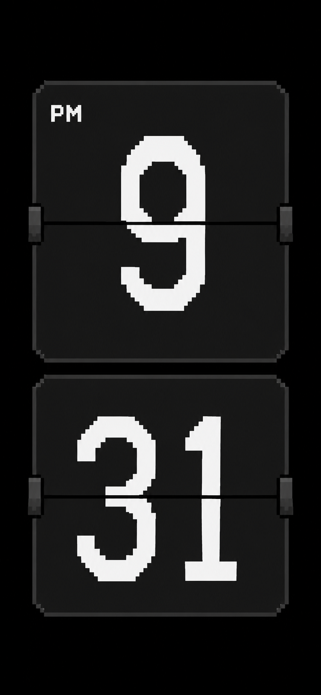
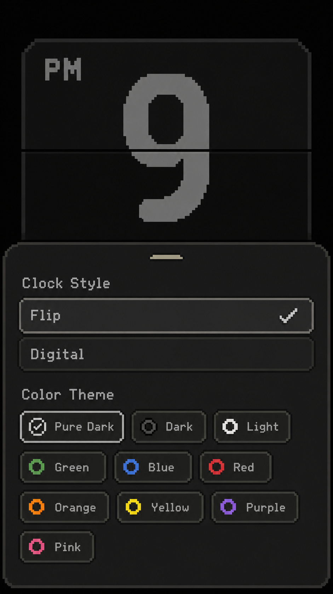
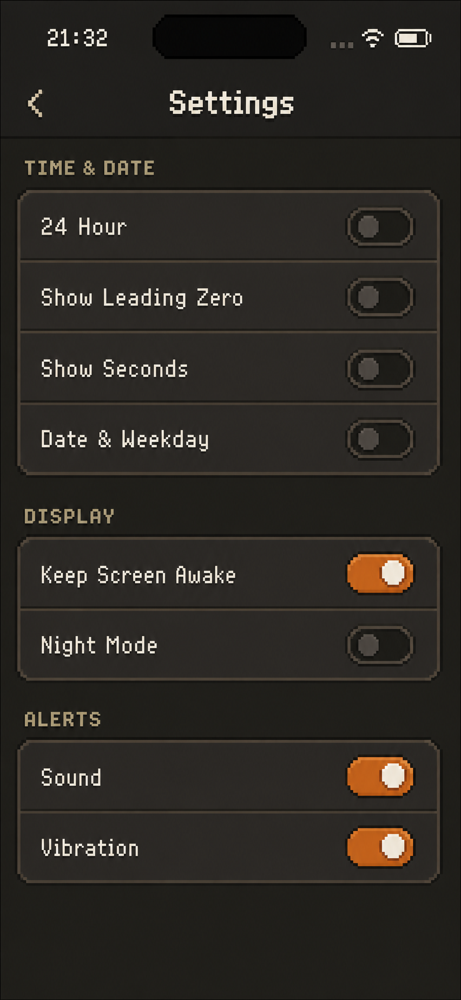

# Tiqlo 像素风实施方案

> 文档状态：设计方案，面向后续 Flutter UI 改造。  
> 设计方向：**Minimal Pixel UI（现代极简布局 + 像素字体 + 像素几何）**。  
> 产品基线：以当前 Tiqlo MVP 的 Clock、Theme、Settings 能力为准，不在本方案中扩展产品功能。

## 1. 目标

将 Tiqlo 的主时钟、主题选择器和设置页统一为克制、清晰的像素视觉语言，同时保留桌面时钟应有的易读性、沉浸感和跨尺寸适配能力。

本方案要达到以下结果：

- Clock 始终是视觉中心，像素风不能削弱时间的远距离可读性。
- Theme 和 Settings 使用同一套颜色、字体、切角、描边、阴影和交互状态。
- 设计稿作为风格与结构基准，不按截图像素尺寸硬编码。
- 继续使用 Flutter 动态组件实现主题、时间和翻页动画，不把页面或数字卡片图片化。
- 保持现有状态模型、路由、持久化键和业务行为不变。

## 2. 设计稿索引

### 2.1 Flip 主时钟



设计稿表达的关键特征：

- 纯黑背景，画面中心只有上下堆叠的小时与分钟卡片。
- 卡片使用暖黑渐变、细描边、阶梯切角和克制的暗色阴影。
- 数字为高对比米白色像素字；12 小时制时，AM/PM 放在小时卡左上角。
- 卡片中轴是明确的水平黑线，两侧轴件提供机械翻页感。
- 竖屏按小时、分钟纵向排列；秒数开启时增加同规格卡片。

### 2.2 Theme 底部面板



设计稿表达的关键特征：

- 打开面板后保留上方时钟预览，选择结果即时反映到预览。
- 面板从底部覆盖页面，顶部使用阶梯切角和短拖拽指示条。
- Clock Style 使用整行选择项；选中项有高亮描边和像素勾选标记。
- Color Theme 使用紧凑的自适应网格；色样图标、文字、边框共同表达状态，不能只依赖颜色。
- 面板内容可滚动，不能因小屏、横屏或系统文字缩放而溢出。

### 2.3 Settings 页面



设计稿表达的关键特征：

- 固定深色 chrome，顶部保留平台安全区、返回入口和居中标题。
- 设置项按 Time & Date、Display、Alerts 分为三个语义组。
- 分组标题使用低饱和暖金色，内容容器使用暖灰黑底、细描边和阶梯切角。
- 开关关闭时为暗灰，开启时使用橙色轨道与米白色滑块。
- 每行整体均可点击，行高需满足触控和文字缩放要求。

## 3. 视觉系统

### 3.1 颜色

颜色以语义 token 管理，不在页面和组件中散落硬编码值。下表是实施基线；最终值可在真机对照设计稿后微调，但语义关系不得改变。

| Token | 建议基线 | 用途 |
| --- | --- | --- |
| `pixelBackground` | `#000000` | Clock 主背景、Pure Dark 背景 |
| `pixelChrome` | `#171612` | Theme 面板、Settings 页面背景 |
| `pixelSurface` | `#26231F` | 设置分组和普通选择项 |
| `pixelSurfaceHigh` | `#302C27` | 选中项、悬停态、卡片高光层 |
| `pixelTextPrimary` | `#F4F0E6` | 时间、标题、主要标签 |
| `pixelTextSecondary` | `#AAA59B` | 次要信息、未选中标签 |
| `pixelOutline` | `#5B554B` | 卡片和分组描边、分隔线 |
| `pixelAccent` | `#E87512` | 开启状态和主要激活态 |
| `pixelSection` | `#B8A77C` | Settings 分组标题、拖拽指示条 |
| `pixelShadow` | `#000000` | 硬边阴影和层级分离 |

规则：

- 主要文字与背景的对比度至少达到 WCAG AA；大号时间也应优先达到 4.5:1。
- 激活状态不能只通过颜色区分，必须同时使用勾选、描边、位置或文字状态。
- 设计稿中的柔和光晕只用于弱化背景和建立层次；组件轮廓、文字和像素图标必须保持硬边。
- Flip 与 Digital 各自已有的主题色仍由现有主题模型管理；Pixel UI token 负责页面 chrome 和通用控件，不覆盖时钟主题语义。

### 3.2 字体

字体方案锁定为 **Silkscreen + Pixelify Sans**，并按内容角色分工，不在同一控件中混用两种像素字体。

| Flutter 字体族 | 字体 | 使用范围 | 字重建议 |
| --- | --- | --- | --- |
| `Silkscreen` | Silkscreen | Flip 数字 | `700` |
| `Silkscreen` | Silkscreen | Flip 卡片中的 AM/PM | `400` 或 `700`，以小字号辨识度为准 |
| `PixelifySans` | Pixelify Sans | Settings 标题、分组标题和设置项 | 正文 `500`，标题 `700` |
| `PixelifySans` | Pixelify Sans | Theme、More 等菜单及选择项 | 默认 `500`，选中项 `600` |
| `PixelifySans` | Pixelify Sans | 按钮文字 | `600–700` |
| 平台系统字体 | System fallback | 中文及两款字体未覆盖的字符 | 跟随平台 |

对应的设计 token：

| Token | 字体族 | 用途 |
| --- | --- | --- |
| `pixelFlipDisplay` | `Silkscreen` | Flip 数字 |
| `pixelFlipPeriod` | `Silkscreen` | AM/PM |
| `pixelUiLabel` | `PixelifySans` | Settings、按钮、菜单和通用英文 UI |
| `systemFallback` | 平台系统字体 | 中文、缺失字符和必要的可读性回退 |

约束：

- Digital 数字不改用 Silkscreen，继续使用现有 `DSEG7Classic`，维持七段数码管风格。
- 两款字体加入项目资源前必须确认允许随应用分发，并记录字体文件来源及授权文本。
- `0–9` 在 Flip 卡片内应保持稳定宽度和基线；不同数字切换时不能引起卡片布局抖动。
- 小字号下检查 `1/I`、`0/O`、`5/S` 的辨识度，不能为追求像素感牺牲设置项可读性。
- 中文不使用 Silkscreen 或 Pixelify Sans 强行替代，也不通过低分辨率栅格化伪造像素效果。
- 字体渲染不主动降低分辨率。像素感来自字体轮廓和几何结构，而不是模糊或马赛克效果。

### 3.3 像素几何

- 不使用普通连续圆角模拟像素切角。通用容器使用阶梯式 Path 或 ShapeBorder。
- 基础像素单位为 `4 dp`；切角、描边偏移和硬阴影尽量对齐该网格。
- 小容器建议切角深度 `8 dp`，面板和大卡片建议 `12–16 dp`，具体数值随组件尺寸缩放并设置上下限。
- 描边默认 `1–2 dp`；高密度屏幕需要对齐物理像素，避免半像素造成发虚。
- 阴影使用短距离、低模糊或零模糊的硬边阴影。大面积环境暗化可以柔和，但不能污染组件边缘。
- 像素 PNG 使用整数倍缩放并设置 `FilterQuality.none`；优先使用代码绘制或适合硬边渲染的矢量资源。

### 3.4 间距与触控

- 页面水平安全间距：手机窄屏至少 `16 dp`，常规手机建议 `20–24 dp`。
- 基础间距序列：`4 / 8 / 12 / 16 / 24 / 32 dp`。
- 可交互区域最小为 `48 × 48 dp`；像素图标本身可以更小，但必须置于合格的点击区域内。
- Settings 行默认不低于 `64 dp`；文字放大后允许行高增长，不截断文本。
- 使用 SafeArea 处理刘海、Dynamic Island、桌面窗口边界和系统手势区，不复刻设计稿中的系统状态栏。

## 4. 页面规范

### 4.1 Flip 主时钟

#### 布局

- 时钟内容在可用区域内水平、垂直居中。
- 竖屏时小时、分钟、可选秒数纵向排列；横屏时改为横向排列。
- 所有卡片保持同一宽高比和视觉重量，通过约束和 `FittedBox` 适配，不为不同方向复制页面。
- 开启 Date & Weekday 时，日期位于卡片组下方并使用次要文字色；Night Mode 开启后继续按现有行为隐藏日期和秒数。
- 12 小时制在小时卡左上角显示 AM/PM；24 小时制不保留空占位。

#### 卡片外观

- 上下半卡使用略有差异的暖黑色或同色渐变，中心分割线始终清晰。
- 外轮廓使用阶梯切角、暗色描边和短硬阴影。
- 中轴两侧绘制对称轴件；轴件属于装饰层，不参与布局和点击。
- 数字应充分占据卡片但保留安全边距，切换数值时不能发生横向跳动。
- Pure Dark 主题以黑背景、近黑卡片和米白数字为基准；全部十组 Flip 配色继续使用现有 `FlipPaletteId`。

#### 翻页动画

- 保留当前上下半层裁剪与 3D `rotateX` 实现，不使用 Lottie 或逐帧 PNG。
- 数值变化时，上半旧值向下翻至 90°，随后下半新值从 90°展开；静止层必须在两个阶段正确衔接。
- 动画期间保持中心轴、卡片外框和布局稳定，避免整张卡片重排。
- 动画建议在 `450–700 ms` 内完成；最终时长以真机可读性与连续秒数模式的稳定性为准。
- 系统启用“减少动态效果”时，使用短淡入或直接替换数字，不能强制播放 3D 翻转。

### 4.2 Theme 底部面板

#### 结构

```text
Clock 实时预览
└─ Pixel Theme Sheet
   ├─ Drag Handle
   ├─ Clock Style
   │  ├─ Flip
   │  └─ Digital
   └─ Color Theme
      └─ 当前样式对应的配色网格
```

- 沿用从 Clock 工具栏打开 Theme 的现有流程。
- 面板打开时，顶部保留足够的 Clock 可视区域；小屏或横屏可减少预览高度，但不能让选择内容不可达。
- 面板高度受可用空间约束，内部内容独立滚动。
- 选择 Clock Style 后立即切换预览，并展示该样式自己的配色；Flip 和 Digital 的配色选择相互独立保留。
- 选择配色后即时生效并通过现有存储自动保存，不增加确认按钮。

#### Clock Style 选择项

- 使用自定义像素选择行替代默认 `ListTile` 外观。
- 选中项同时显示高亮描边、较高表面色和像素勾选；未选中项保留可感知边界。
- 整行可点击，键盘焦点、鼠标悬停、按下和禁用状态均有清晰反馈。

#### Color Theme 网格

- Flip 展示现有十组：Pure Dark、Dark、Light、Green、Blue、Red、Orange、Yellow、Purple、Pink。
- Digital 展示现有九组：Digital、Digital-Blue、Digital-Red、Digital-Amber、Digital-Orange、Pure Dark、Dark、Light、Classic。
- 网格根据可用宽度自动换列，不固定复刻截图的三列结构。
- 每项包含色样、名称和选中状态。色样使用像素环或方形切角色块，不使用平滑圆形作为主要视觉。
- Light、Yellow 等浅色主题的选中标记必须保持足够对比度。

### 4.3 Settings 页面

#### 信息结构

设置项和语义保持当前 MVP 不变：

| 分组 | 设置项 | 初始状态 |
| --- | --- | --- |
| Time & Date | 24 Hour | 关闭（12 小时制） |
| Time & Date | Show Leading Zero | 关闭 |
| Time & Date | Show Seconds | 关闭 |
| Time & Date | Date & Weekday | 关闭 |
| Display | Keep Screen Awake | 开启 |
| Display | Night Mode | 关闭 |
| Alerts | Sound | 开启 |
| Alerts | Vibration | 开启 |

> 默认值以当前 `ClockEngine` 和设置存储实现为最终依据；文档不创建新的偏好项或存储键。

#### 页面与分组

- AppBar 使用固定深色背景、像素标题和像素化返回图标；返回行为保持平台导航语义。
- 页面垂直滚动，底部保留 SafeArea 间距。
- 分组标题使用大写英文和暖金色，但仍向语义树暴露原始可读标签。
- 分组容器使用阶梯切角和细描边；内部行通过清晰分隔线分开。
- 点击行标签或开关均切换对应设置，点击区域不能只覆盖开关本体。

#### Pixel Switch

- 关闭：暗色轨道、灰色滑块、弱描边。
- 开启：橙色轨道、米白滑块、较亮描边。
- 滑块按像素网格平移，外形使用阶梯切角，不使用 Material 默认胶囊圆角。
- 状态变化保留短促位移动画，建议 `120–180 ms`；关闭动画时仍要立即更新语义状态。
- 支持点击、键盘切换、焦点态和屏幕阅读器的 on/off 描述。

## 5. 推荐组件边界

后续实现应建立小而稳定的 Pixel UI 组件层，业务状态继续留在现有 Clock 模块中。

| 概念组件 | 职责 | 不负责 |
| --- | --- | --- |
| `PixelTheme` / `PixelTokens` | 提供颜色、字体、间距、描边和动效 token | Clock 配色业务选择 |
| `PixelCutShape` | 生成可缩放的阶梯切角 Path/ShapeBorder | 页面布局 |
| `PixelPanel` | 统一表面、描边、切角、阴影和裁剪 | 设置状态读写 |
| `PixelSelectionTile` | 展示文本、选中标记及完整交互状态 | 保存主题偏好 |
| `PixelColorOption` | 展示主题色样、名称和选中态 | 定义主题列表 |
| `PixelSwitch` | 展示并操作布尔值，提供语义和键盘交互 | 持久化布尔值 |
| `PixelSection` | 组合分组标题、容器、行和分隔线 | 决定设置项内容 |
| `FlipCard` | 卡片绘制、上下半层和数值翻转 | 获取系统时间 |

组件规则：

- 视觉组件通过参数接收状态和回调，不直接读取 Riverpod provider 或 SharedPreferences。
- 语义标签、焦点顺序和键盘操作由组件对外契约覆盖，不能仅依赖视觉层。
- `ClockEngine`、`ClockSnapshot`、`ClockThemeId`、`FlipPaletteId` 和 `DigitalThemeId` 的职责及持久化方式保持不变。
- Pixel UI 是应用 chrome 的设计系统；Clock 自身的 Flip/Digital palette 仍是独立的产品主题。

## 6. 响应式与平台适配

### 6.1 竖屏

- 以三张设计稿的构图和信息层级为基准。
- Flip 卡片纵向排列；Theme 面板从底部进入；Settings 使用单列分组。
- 小屏优先缩放时钟预览，其次压缩非关键间距，不缩小触控区域。

### 6.2 横屏

- Clock 卡片横向排列并尽量利用宽度。
- Theme 面板允许提高最大宽度并减少预览高度；内容仍可滚动。
- Settings 在常规横屏保持单列居中并限制最大内容宽度，避免每行跨度过大。

### 6.3 桌面与 Web

- Clock 继续支持现有全屏能力。
- Theme 面板设置最大内容宽度，宽窗口下不把选项无限拉伸。
- 所有控件提供 hover、focus 和键盘操作状态；焦点轮廓应符合像素语言但不能被裁剪。
- 窗口缩放时使用同一页面响应式布局，不新增桌面专用路由。

### 6.4 文字缩放

- Settings 和 Theme 至少验证系统文字缩放 `1.0×`、`1.3×`、`2.0×`。
- 长标签允许增加行高或换行；不能缩放文字以强行塞进固定高度。
- 超大文字下 Theme 配色网格可以降为更少列，所有选项仍可通过滚动访问。

## 7. 状态、反馈与无障碍

- 点击反馈使用表面亮度、描边或 `1–2 dp` 位移表达，避免大面积水波纹破坏像素视觉；仍需让用户明确感知按下状态。
- 键盘焦点使用高对比阶梯描边，不与选中描边混淆。
- 主题色样向屏幕阅读器提供名称和选中状态，不能只读出“按钮”。
- Settings 开关应把设置项标签、当前状态和切换动作组合成一个语义节点，避免重复朗读。
- 装饰性的轴件、阴影、像素角和拖拽指示条不进入语义树。
- Night Mode 沿用当前产品行为：隐藏秒数和日期、降低时钟视觉强度并尝试降低应用亮度；它不等同于 Material 亮暗主题。

## 8. 素材与渲染约束

- 主时钟数字、标签、边框、开关和简单图标优先由 Flutter 文字、ShapeBorder、CustomPainter 或适合硬边的 SVG 绘制。
- 不把整页、Theme 面板、Settings 分组或 Flip 数字导出为位图。
- 必须使用 PNG 的像素素材应提供整数倍率资源，并在显示时使用 `FilterQuality.none`。
- 不使用 Lottie 实现 Flip 翻页；复杂度不足以抵消资源体积、主题适配和动态数字组合成本。
- 图标采用同一网格、描边粗细和切角规则；禁止在同一页面混用默认 Material 圆润图标与像素图标。
- 对发光、渐变和阴影做真机检查，确保低亮度与 OLED 屏幕上仍能看清边界且没有明显色带。

## 9. 实施顺序

### 阶段一：设计系统基础

- 引入 Silkscreen 与 Pixelify Sans，登记字体来源和授权，并配置中文系统字体回退链。
- 建立语义颜色、排版、间距、描边、阴影和动画 token。
- 完成阶梯切角、PixelPanel、PixelSwitch 等基础组件及组件级测试。

### 阶段二：Clock 与 Flip

- 将 Flip 卡片外形、数字、AM/PM、中轴和轴件更新为设计稿语言。
- 保留现有时间数据流和翻页算法，补齐减少动态效果分支。
- 验证 12/24 小时、前导零、秒数、日期、Night Mode 及横竖屏组合。

### 阶段三：Theme

- 将底部面板、样式选择项和配色网格替换为 Pixel UI 组件。
- 保留即时预览、独立配色记忆和自动持久化行为。
- 补齐小屏、横屏、桌面键鼠与超大字体适配。

### 阶段四：Settings

- 更新页面 chrome、分组容器、分隔线和 Pixel Switch。
- 保留全部设置项、默认值、点击行为和持久化逻辑。
- 完成语义、键盘、触控尺寸及滚动可达性验证。

### 阶段五：视觉校准

- 在代表性手机、横屏、桌面和 Web 尺寸生成 golden 截图。
- 对照设计稿统一字体基线、切角比例、边框亮度、阴影和间距。
- 检查浅色配色、Night Mode、OLED 低亮度与高文字缩放场景。

## 10. 验收标准

### 视觉一致性

- Clock、Theme、Settings 明确属于同一套 Minimal Pixel UI。
- 所有主要容器使用统一阶梯切角；不存在突兀的默认 Material 圆角组件。
- 文字、图标和边框边缘清晰，没有因插值或模糊导致的发虚。
- 开启、关闭、选中、未选中、按下、悬停和焦点状态均可区分。

### 功能回归

- Flip 和 Digital 可以即时切换并在重启后恢复。
- Flip 的十组配色与 Digital 的九组配色完整、名称正确、互不覆盖。
- 24 Hour、Show Leading Zero、Show Seconds、Date & Weekday、Keep Screen Awake、Night Mode、Sound、Vibration 均保持现有行为和持久化能力。
- Flip 翻页过程中数字连续、层次正确，不发生跳帧、错字或布局位移。
- Night Mode、全屏和 Clock chrome 的既有行为不被像素风改造破坏。

### 适配与无障碍

- 常见手机竖屏、手机横屏、平板、桌面和 Web 窗口均无溢出。
- Theme 和 Settings 在内容超高时可以完整滚动访问。
- 触控目标不小于 `48 × 48 dp`，键盘可遍历所有操作项。
- 在 `2.0×` 文字缩放下功能仍可用，主要文字不截断。
- 屏幕阅读器可以朗读控件名称、当前状态和选中状态。

## 11. 范围边界

本方案只定义现有 Tiqlo MVP 的像素视觉改造，不包含：

- Focus、Timer、统计页面或新的主导航入口。
- 新增 Clock 样式、配色商店、主题下载或付费主题。
- 修改设置数据模型、路由结构或 SharedPreferences 键。
- 自动 Night Mode、环境光感知或系统主题联动。
- 将横屏实现为独立页面。
- 用整页图片、Lottie 或视频替代可交互 Flutter UI。

后续实现若需要改变上述边界，应先更新产品文档或 ADR，不在视觉改造中隐式扩展。
